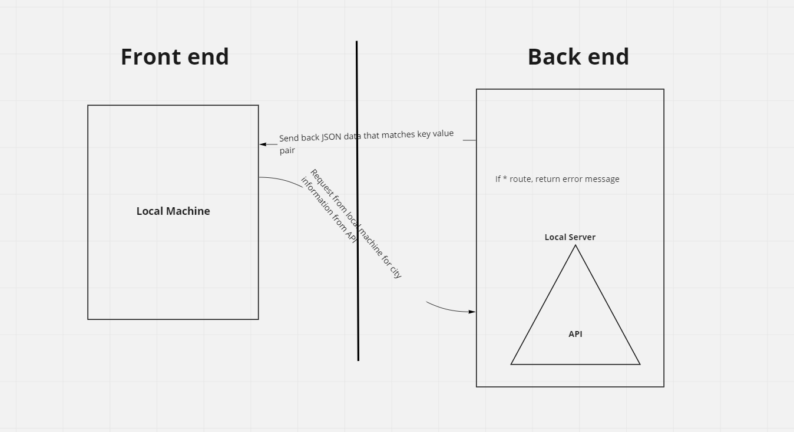

# City Explorer

**Author**: Vinny Shipley

**Version**: 1.0.0

## Overwiew

This app is designed to hlp people find out more information about potential places that they would like to visit, this side of the app housing the weather API that the front end will access

## Getting Started

The user needs to have React installed to run this application, as well as express, dotenv, and cors

## Architecture

The app uses React, LocationIQ API, Express, and Nodemon

## Change Log

05-17-2022 Created

## Credit and Collaborations

Elizabeth Hammes and Vinny Shipley created the API wireframe shown here: 

### Lab 07

Name of feature: Setting up Local Server

Estimate of time needed to complete: 3 hours

Start time: 3 pm

Finish time: 6 pm (not completed)

Actual time needed to complete: 3 hours